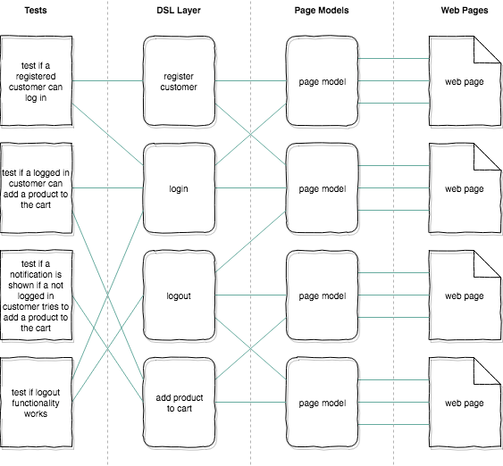

[Home](../README.md)

# Writing the test suite

## Directory structure
The following directories are available:

- `tests/` : This is where you keep all of your tests.
- `dsl/` : The is where you keep your Domain Specific Language Layers (Domain Logic).
- `page-models/` : This is where you keep all of your Page Models and actions.

## Architecture
It's important to organize your tests in a logical, maintainable way. If we
look at a basic web application, and we want to structure it in a solid,
testable way, we can look at it like this:



When looking at above, keep the following rules in mind to keep your tests
maintainable:

- **Page Models** may only interact with **one web page** at the same time.
    - A Page Model is the **only allowed entity** to contain logic that directly relates to the web page (for example: CSS selectors and/or feature lists).
    - For more information on Page Models, see the [TestCafé documentation](http://devexpress.github.io/testcafe/documentation/recipes/using-page-model.html)
- **Domain Specific Language Layers** may only interact with **page models** and only contain **domain logic**; no tests and/or assertions.
- **Tests** should only interact with **Domain Specific Language Layers** to use business logic; they should mostly exists of tests and/or assertions.
- **utilities**: Utilities to interact with the browser in e2e tests.
- **runner.js**: This file contains the code for the [TestCafé runner](https://devexpress.github.io/testcafe/documentation/using-testcafe/programming-interface/runner.html).

### Used language
Since Testcafé is written in modern JavaScript, and all the examples and documentation are in modern JavaScript, it only makes sense that the test suite is written in modern JavaScript as well.

##### TypeScript
If you're using TypeScript in your project, [TestCafé supports writing your test suite in TypeScript](https://devexpress.github.io/testcafe/documentation/test-api/typescript-support.html)

## Semantics
To write a test suite in a way that it can be easily understood and/or extended by any other developer, it's important to have some semantics to follow:

* If you import a **page model** use an alias and suffix it with `Page`:
```js
import ProductPage from '../page-models/catalog/product'
```
* When looking for the perfect selector to target the element you want to use to make your test, you quickly find yourself thinking about what to use best.
Classes are used for CSS to apply styling to the page. Id's are often used for javascript hooks to apply interaction or to retrieve fields from a form.
To separate concerns as much as possible and also make redesigns in the future easier for the written tests we introduce the concept of data-testid:
```html


```
With the html in place we can easily make selectors like:
```js
const logo = Selector('[data-testid="logo"]')
const logoInverse = Selector('[data-testid="logo-inverse"]')
```
This will make it clear for any other developer who looks at the code at a later point in time that this attribute is used for testing.
This reduces the chance that future development will break the e2e tests easily.

P.S. If you are worried that these extra attributes ship to the end-user, we believe that the advantages outweigh the disadvantages. With them in place in production you can also quickly run e2e tests on production (no manual work). The 'information leak' is so minimal that it can't be used for hackers to penetrate the frontend more easily.
For React applications there is already an automated [plugin for babelplugin for babel](https://www.npmjs.com/package/babel-plugin-react-remove-properties) to remove properties.

## Linting
TestCafe defines and uses 2 globals in its tests: `fixture` & `test`. If you're using a linting tool, e.g. ESLint, it will possibly complain about these globals being undefined. To fix these error messages, add these 2 global to your linter's configuration.

**ESLint:**
```json
{
  "globals": {
    "fixture": true,
    "test": true
  }
}
```
PS: We are aware of [eslint-plugin-testcafe](https://github.com/miherlosev/eslint-plugin-testcafe/blob/master/index.js), but this package does nothing more than follow the same steps as we explained here.

## Utilities
There are various utilities you can use that provide some functionality that
you might need when writing your tests:

- [Browser](./utilities/browser.md)

## Repetitive tasks per test
TestCafe supports something called ['Test Hooks'](https://devexpress.github.io/testcafe/documentation/test-api/test-code-structure.html#test-hooks). They can let you execute code before each test or even in between each test.
